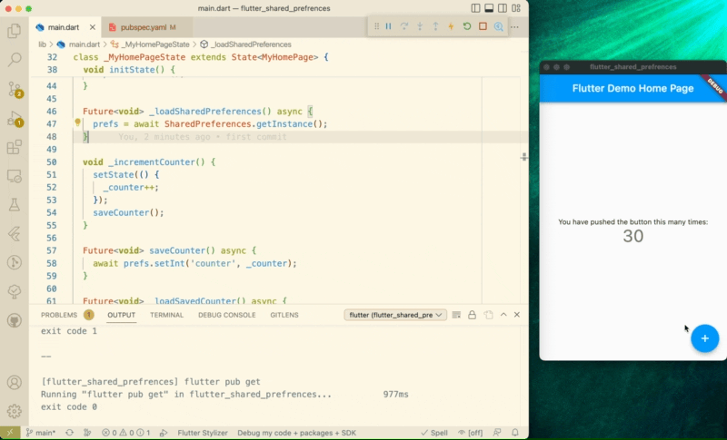

# Flutter SharedPreferences Example
Example project using the SharedPreferences package in flutter counter app.

## Built With
* [VsCode](https://code.visualstudio.com/)

## Used Libraries & SDKs
* [SharedPreferences](https://pub.dev/packages/shared_preferences)

